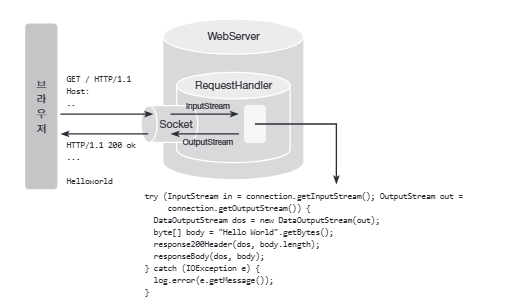
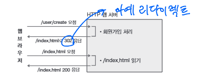

# 실습을 위한 개발 환경 세팅
* https://github.com/slipp/web-application-server 프로젝트를 자신의 계정으로 Fork한다. Github 우측 상단의 Fork 버튼을 클릭하면 자신의 계정으로 Fork된다.
* Fork한 프로젝트를 eclipse 또는 터미널에서 clone 한다.
* Fork한 프로젝트를 eclipse로 import한 후에 Maven 빌드 도구를 활용해 eclipse 프로젝트로 변환한다.(mvn eclipse:clean eclipse:eclipse)
* 빌드가 성공하면 반드시 refresh(fn + f5)를 실행해야 한다.

# 웹 서버 시작 및 테스트
* webserver.WebServer 는 사용자의 요청을 받아 RequestHandler에 작업을 위임하는 클래스이다.
* 사용자 요청에 대한 모든 처리는 RequestHandler 클래스의 run() 메서드가 담당한다.
* WebServer를 실행한 후 브라우저에서 http://localhost:8080으로 접속해 "Hello World" 메시지가 출력되는지 확인한다.

# 각 요구사항별 학습 내용 정리
* 구현 단계에서는 각 요구사항을 구현하는데 집중한다. 
* 구현을 완료한 후 구현 과정에서 새롭게 알게된 내용, 궁금한 내용을 기록한다.
* 각 요구사항을 구현하는 것이 중요한 것이 아니라 구현 과정을 통해 학습한 내용을 인식하는 것이 배움에 중요하다. 

### 요구사항 1 - http://localhost:8080/index.html로 접속시 응답

* `socket.getInputStream()`을 하면 끝이 없어서 `!line.isEmpty()` 조건이 중요!

### 요구사항 2 - get 방식으로 회원가입
* 

### 요구사항 3 - post 방식으로 회원가입
* 

### 요구사항 4 - redirect 방식으로 이동
* 

### 요구사항 5 - cookie
* 

### 요구사항 6 - stylesheet 적용
* 

### 기타
* LOG LEVEL: `TRACE` < `DEBUG` < `INFO` < `WARN` < `ERROR`
* 개발 단계에서 DEBUG 사용 후 운영에서 WARN / ERROR 레벨 사용 

# 4장 HTTP 웹서버 이해하기 

## HTTP 요청
* 각 요청마다 클라이언트의 다른 포트로 연결되며 각 요청에 대응하는 스레드 별도 생성해 동시에 실행
* HTTP Request Structure: Request Line(Required), Header(Required), Body 
* Request Line: `<HTTP METHOD> <URI> <HTTP VERSION>`
* Request Header: `<key> : <value>`
* blank line between header and body

```
POST /user/create HTTP/1.1
Host: localhost:8080
Content-Type: application/x-www-form-urlencoded
Content-Length: 61
Cookie: logined=true

userId=test123&password=pass123&name=%ED%99%8D%EA%B8%B8%EB%8F%99&email=test%40example.com
```

## HTTP 통신 
* 웹페이지 구성 시 서버에서 응답을 하나로 보내지 않음 (CSS, 이미지 따로 등)
* path에서 ? 기준으로 querystring 분리 
* querystring 한계: 보안 취약, 길이제한 
* HTML은 GET, POST만 지원, 이후 AJAX로 DELETE, PUT 등 사용 가능 
* 브라우저는 이전 요청을 저장하기 때문에 새로고침하면 같은 요청이 다시 보내짐
  <br>\> 이를 해결하기 위해 302 status 코드로 응답해서 리다이렉트 
<br>\> 302로 보내면 클라이언트가 Location: 값 읽어서 리다이렉트함

* 2XX 성공, 3XX 리다이렉션/추가액션, 4XX 요청에러, 5XX 서버에러
* Set-Cookie로 쿠키 세팅 가능 > 이후 모든 요청에서 쿠키를 보내므로 쿠키값으로 상태 확인가능
<br> 클라이언트에서 저장하면 보안이 취약해 이후 서버에서 저장하는 세션 등장
* 